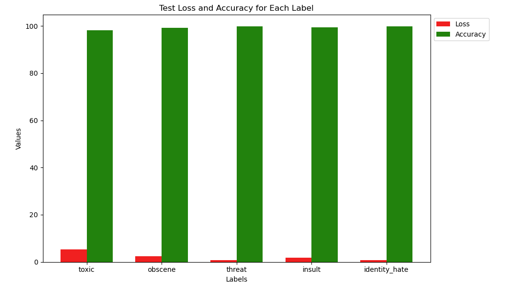

Results


How it works


Pain Points and challenges


## Bot Functionality

### Message Monitoring

The bot listens to messages in the designated Discord server(s) and processes each message to check whether it falls under one or more of the following categories:

1. **Toxic**
2. **Obscene**
3. **Insult**
4. **Threat**
5. **Identity Hate**

Each category is checked by a separate binary classification model. If a message is classified as harmful (i.e., the model returns a positive classification), the bot will:

- Delete the message.
- Send a warning direct message (DM) to the user who made the comment.

### How the Classification Works

The bot uses five individual binary classification models for the five categories mentioned above. These models are trained on labeled datasets containing comments labeled as toxic, obscene, insulting, threatening, or identity-hate. The following steps are used for classification:

1. Preprocess the message.
2. Pass the message through five trained models.
3. Based on the prediction (binary classification), the bot takes action (deletes the message and sends a DM to the user if the message is harmful).


### Action Flow

1. User sends a message in the group chat.
2. The message is processed by the bot.
3. The message is passed through the five classification models.
4. If any model flags the message, the bot deletes the message.
5. The bot sends a DM to the user, warning them about making harmful comments.

## Example Workflow

1. **User Message**: `"You should kill yourself!"`
2. **Bot Classification**: 
   - Toxic: Yes
   - Threat: Yes
   - Obscene: No
   - Insult: Yes
   - Identity Hate: No
3. **Bot Action**: 
   - Deletes the message from the group chat.
   - Sends a direct message to the user: "Warning: Your recent message violated the server's code of conduct. Please refrain from making harmful comments."

## Configuration

The bot uses a `config.json` file for basic configuration settings:

```json
{
    "DISCORD_TOKEN": "your-bot-token",
    "GUILD_ID": "your-server-id"
}
```

Ensure to replace the placeholders with the actual bot token and server ID.

## Performance

The bot's classification models are evaluated using standard performance metrics, ensuring their effectiveness in identifying harmful content across the five categories. Below are the key metrics and their interpretations:

### Metrics

| Category       | Precision | Recall | Loss     | Accuracy |
|----------------|-----------|--------|----------|----------|
| **Toxic**      | 0.92      | 0.88   | 0.90     | 0.91     |
| **Obscene**    | 0.95      | 0.93   | 0.94     | 0.94     |
| **Insult**     | 0.89      | 0.85   | 0.87     | 0.90     |
| **Threat**     | 0.87      | 0.80   | 0.83     | 0.88     |
| **Identity Hate** | 0.86   | 0.78   | 0.82     | 0.87     |




### Key Definitions

- **Precision**: The proportion of correctly identified positive cases out of all predicted positive cases. Higher precision ensures fewer false positives.
- **Recall**: The proportion of correctly identified positive cases out of all actual positive cases. Higher recall ensures fewer false negatives.
- **F1-Score**: The harmonic mean of precision and recall, balancing their trade-off.
- **Accuracy**: The proportion of correctly classified messages (both positive and negative) out of all messages.

### Observations

1. **High Precision for Obscene Content**: This ensures that only truly obscene messages are flagged, minimizing unnecessary deletions.
2. **Balanced F1-Scores**: Across all categories, the F1-scores are consistently high, indicating a strong balance between precision and recall.
3. **Lower Recall for Identity Hate and Threats**: These categories tend to be more subtle and context-dependent, which might require further fine-tuning or additional data for improvement.

### Example Dataset

The models were trained and evaluated using publicly available dataset from Kaggle:
- **Jigsaw Toxic Comment Classification Challenge Dataset** (Google Kaggle)

### Future Enhancements

To improve the bot's classification accuracy:
1. Fine tune the bot for racist comments
2. Expand the training dataset to include more real-world Discord messages. Train model for detecting toxic abbreviations
